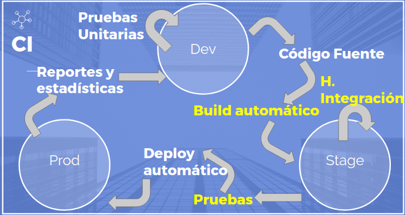

# CI2
## Continuous Improvement & Integration

---

+++

## ¿Por qué me gusta programar?
## ¿Cuándo me siento satisfecho con lo que hago?
## ¿Qué es lo más divertido?
## ¿Estás orgulloso de ser desarrollador?

---

## ¿Qué delegarías?

---

## Antecedentes y Consecuentes
* [Extreme Programming](https://es.wikipedia.org/wiki/Programaci%C3%B3n_extrema)
* [CImprovement](https://leankit.com/learn/kanban/continuous-improvement/)
* [Filosofía lean](https://es.wikipedia.org/wiki/Lean_startup)
* [SCRUM/Kanban](https://es.wikipedia.org/wiki/Kanban_(desarrollo))
* ...

+++

+++

## ¿Qué comparten las metodologías

+++

* Iteraciones
* Simplificar
* Medir
* Automatizar
* Enfocarse

---

## ¿En qué nos enfocamos?, ¿Qué fases entregan valor?

+++

# ¿Qué requerimos para programar una línea de código?

+++

* Electricidad
* Internet
* Repositorio
* Un vaso de agua (café)
* Servidor de CI
* SO
* Editor de texto
* Compilador/Intérprete
* Frameworks
* Helpers (debug, reviewers, deploy, monitor, sniffers)

---

## ¿Qué vamos a aprender?

+++

* Proceso de CI
* Ambientes
* El servidor de CI
* Pruebas automatizadas
* Deployment
* Cómo llegar a CD

---

# Proceso de CI

+++

+++

## ¿Qué es lo mínimo para lograr CI?

+++

1. Cambios/Desarrollos granulares
2. Repositorio único para el proyecto*
3. Automatizar pruebas/builds
4. Tener una máquina de integración

+++

## Después del primer checklist...

+++

1. Arreglar builds rotos
2. Mantener el build en cuestión de pocos minutos
3. Probar en clones de producción
4. Todos tener el proyecto a la mano (ejecutable...)
5. Todos deben de ver qué es lo que está sucediendo

+++

## Por último...

+++

1. Automatizar el deployment

Automatizar el despliegue requere mucho esfuerzo y maduración del proyecto, es importante tener experiencia y 
varias iteraciones de los checklists anteriores. Los beneficios de aplicar cualquier metodología ágil solo se ve después de automatizar tareas

+++

## Ejercicio automatizar deploy

---

# Ambientes

+++
